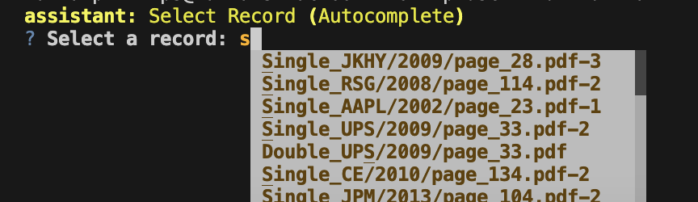
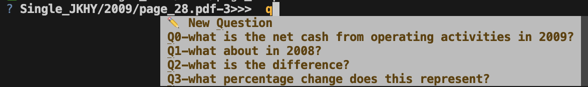
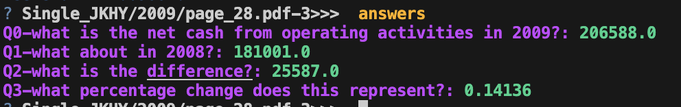

# ConvFinQA Assignment

### CLI App Structure


## Agents teste
 * `provider_v1.py`: document only Q&A 
 * `provider_v2.py`: `provider_v1.py` + Golden Examples + Chain of Thought 
 * `provider_v3.py`:  `provider_v2.py` + tools 
 * `provider_v4.py`: + multi agent


### Prerequisites
- Python 3.12+
- [UV environment manager](https://docs.astral.sh/uv/getting-started/installation/)

### Setup
1. Clone this repository
2. Setup UV environment 
3. .env file 
4. 


## Pre-requities: `.env` 
```bash 

ANTHROPIC_API_KEY=sk-ant-%%%%%%%%%%%%%%%%%%%%%%%%%%%%

```

## Run Evaluations 
```bash 

promptfoo eval ## to run `promptfooconfig.yaml` to back test different LLM s

promptfoo view ## to spin up local server to review evalations results by LLM provider


```


### Run Chat App
Test out the Agent running app and selecting by Report and Question. 
```bash 

uv init 
# set up env -- reinstall 
uv sync

# run app: (then > Select Record > Ask Question 
un run main 

```


#### `Select Record`
Search or autocomplete from available reports, press `ENTER` to confirm

[](figures/app_select_record.png)  


#### `Enter Question` 
Free form or autocomplete with ConFinQA questions

[](figures/app_enter_question.png)  

See Record Question and Answers 

[](figures/app_see_answers.png)


| Input | Action |
|---|---|
| Free text question | Query the selected record |
| Autocomplete (type `q` to start) | Browse training data questions |
| `answers` | To see all Question & Answers from ConFinQA data for record |
| `change` or `switch` | Go back to Record Selection |
| `quit` or `exit` | Shutdown app |

    


