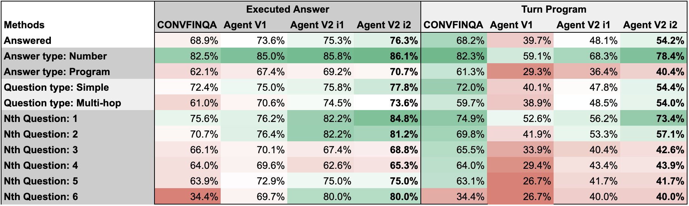

# ConvFinQA Report 
Table of contents: 
1. Solution & Evalution 
2. Agent Design  
3. Evaluation Process
4. CLI App Walkthrough
5. Future Work
6. Code Delivery 


## 1.Solution & Evaluation 
Two agents built and compared against [ConvFinQA-paper](https://arxiv.org/pdf/2210.03849) for key categories of Question and Answer. Image 1 below shows tried Agents perfomance against ConvFinQA benchmark, best performance agent was "Agent-V2_i2" LLM agent split by execution and reflection roles. 

**Findings:** 
* Agent improved when categorising Questions and Answer types before answering the question. 
* Lift in accurary  for `turn_program`, "Agent_v2_i1" vs "Agent_v2_i2", shows a reflection step improves performance versus trying to do everything in 1 LLM>  
* Would continute to split out Agent LLMs for combinations of Answer type ( Number / Program ) and Question type ( Simple / Multi-hop). 
* **Shortcomings**: 
  * Struggles with Multi-hop questions. Need split out 'multi-hop' questions to retrieve , could be many questions to get data required. 
  * Struggles with Program answers: to improve calcuation need to split out LLM that only does calcuation. 
  * Struggues with long question windows: more questions in history / accuracy goes down; need to split out retrival agent to filter down the content fed to LLM.
  * Turn_program prediction under performing. Split out LLM to purely focus on syntax, close the accuracy gap between executed_answer and turn_program. Look into tooling for `turn_program` syntax. 

[](figures/app_evalution_summ.png)  
*Image 1: ConFinQA vs Agent V1/V2 Performance*


Agent tested: 
 * `Agent_v1`: Execution
 * `Agent_v2`: Execution and Reflection 
    * `Agent_v2_i1`: Execution with consideration for Question & Answer categorisation.
    * `Agent_v2_i2`: Reflection on `Agent_v2_i1` focus on "program" syntax


## 2. Agent Design: Structure, Reasoning & Classification

 * **Pydantic** to set structure
 * **Tooling** control structure on Agent output 
 * **Prompting** Chain-of-though / Few-Shot / Plan before execute. 
 * **Output structure**: get LLM to classify Answer & Question type before planning a solution to impiment.
    * Answer type: Number or Program 
    * Question type: Simple or Multi-hop  
 * **Reflection**: review LLM response and focus on known weaknesses in agent , improve `turn_program` syntax 


## 3. Evaluation Process 

Back testing of Agent on ConFinQA was done through using agent to answer questions and and compare accuracy for key cuts of performance from the the ConFinQA paper. 

What are the key cuts of the data:
 * **Answer type**  "Number" or "Program" requires a series of calucations 
 * **Question type**: "Simple" (linear) or "Multi-hop" augmentating of previous quesitons and calculation
 * **Nth question**: how many questions in the history, accuracy falls as more questions asked 

 Back test volumes? 
 * `Agent_v1`: ~1k records 
 * `Agent_v2`: ~200 records 
 * Full dataset: 3.4k records

```bash 

## Run Backtest on ConFinQA data
uv run python agent_v2_evaluation.py

```


### 4. CLI App Walkthrough
Test out the Agent running app and selecting by Report and Question. 

```bash 

# set up env -- reinstall 
uv sync

# run app: (then > Select Record > Ask Question 
un run main 

```

#### `Select Record`
Search or autocomplete from available reports, press `ENTER` to confirm

[](figures/app_select_record.png)  


| Input | Action |
|---|---|
| Free text question | enter record_id to query |
| Autocomplete (type `letter` to start) | Browse all records filtered to text |
| `quit` or `exit` | Shutdown app |


#### `Enter Question` 
Free form or autocomplete with ConFinQA questions (type 'q' to see questions)

[](figures/app_enter_question.png)  

See Record Question and Answers 

[](figures/app_see_answers.png)


| Input | Action |
|---|---|
| Free text question | Query the selected record |
| Autocomplete (type `q` to start) | Browse training data questions |
| `answers` | To see all Question & Answers from ConFinQA data for record |
| `change` or `switch` | Go back to Record Selection |
| `quit` or `exit` | Shutdown app |

    

## 5.Future Work
 * Test **Heirachical multi-agent**:  
   * **Head LLM** classifies question & answer by "Number vs Program" and "Simple vs Multi-hop"  (4 combinations)
   * **4x LLM** for each  question * answer type solving for the biggest errors in evaluation like filtering messages, writing all questions needed from doc to support question, calcuation. 
   * **Reflection LLM** that consolidates LLM outputs and focuses on `turn_program` syntax and confidence score. 
   * **Redo loop** if confidence score is low to improve accuracy. 

  * Strengthen reliability and trust
    * **Error handling / Unit testing**: test driven development
    * **Confidence scoring**: agent score answer confidence and not return a result 
    * **MCP server**: let MCP handle Tools / Prompts / Resources, make it easy for user to adopt and leverage app. 
    * **Logging**: track Chat App usage/ sentiment


## 6. Code Delivery 

```bash
  nmp-dsci/                                                                        
  ├── README.md                                                                    
  ├── REPORT.md                                                                           
  ├── agent_utils.py   # pull data                                                             
  ├── agent_v1_evaluation.py       # Agent_v1 build and evalation                                                
  ├── agent_v2.py      # Agent_v2 build                                                           
  ├── agent_v2_evaluation.py       # Agent_v2 evaluation                                                
  ├── data_scope.py       # Data discovery   
  ├── evaluations     # scoring / outputs
  │   ├── agent_v1_detailed_results.csv                                            
  │   ├── agent_v1_final_summary.csv                                               
  │   ├── agent_v1_scoring.jsonl
  │   ├── agent_v1_summary.jsonl
  │   ├── agent_v2_final_summary.csv
  │   ├── agent_v2_i1_scoring.jsonl
  │   ├── agent_v2_i2_scoring.jsonl
  │   └── paper_performance.jsonl
  └── src/ # run Chat APP
      ├── __init__.py
      ├── logger.py
      └── main.py # main.py has Agent solution

``` 
